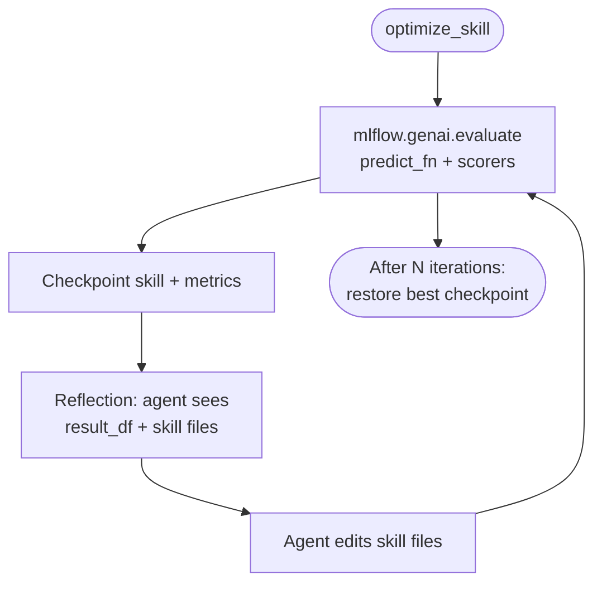
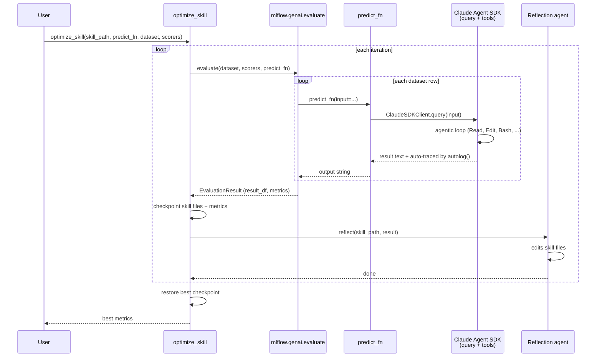

# Skill Optimization via Agent Self-Optimization

**Status**: Draft  
**Date**: 2026-06-26

---

## Problem

Public coding agent skills are written once, often untested, and tuned for the author's specific agent/model. A skill built for Claude Opus may perform poorly on Codex/GPT-5.5. There is no automated way to measure or improve skill quality against a specific target environment.

---

## Goal

Optimize a coding agent skill (`.claude/skills/*.md`) by running it against a test dataset, scoring the results, and letting the agent reflect on failures to edit the skill. Built entirely on existing MLflow primitives.

---

## Architecture

Loop: `evaluate()` to score, reflect, repeat.

```
┌──────────────────────────────────────────────────────┐
│  optimize_skill(                                     │
│      skill_path = ".claude/skills/pr-review.md",     │
│      predict_fn = ...,                               │
│      dataset = [...],                                │
│      scorers = [...],              ← MLflow scorers  │
│  )                                                   │
│                                                      │
│  Internally:                                         │
│    loop:                                             │
│      result = mlflow.genai.evaluate(...)             │
│      reflection agent edits skill files              │
└──────────────────────────────────────────────────────┘
```

**Why `evaluate()`**: parallel predict_fn execution (ThreadPoolExecutor), scorer kwargs resolution (inspects function signatures - different scorers accept different params), per-row error handling, aggregated metrics, and an MLflow run per iteration (audit trail of score progression in the UI). Reimplementing this is ~100 lines of fiddly glue.

**Async is handled**: `evaluate()` auto-wraps async `predict_fn` via `_wrap_async_predict_fn` using `asyncio.run()`.

`predict_fn` uses the Claude Agent SDK (`claude-agent-sdk`). `ClaudeSDKClient.query()` handles the full agentic loop with built-in tools (Read, Edit, Bash, Glob, Grep). `mlflow.anthropic.autolog()` patches the SDK client to create full MLflow traces with LLM spans, tool spans, and token usage automatically (via `process_sdk_messages()` in `mlflow/claude_code/tracing.py`).

---

## What We Build

One function: `optimize_skill`. Loops `evaluate()` + reflection.

```python
def optimize_skill(
    skill_path: str,
    predict_fn: Callable,
    dataset: list[dict],
    scorers: list,
    n_iterations: int = 5,
):
    checkpoints = []

    for i in range(n_iterations):
        # 1. evaluate() handles: parallel execution, scorer kwargs,
        #    error handling, metrics aggregation, MLflow run logging
        result = mlflow.genai.evaluate(
            data=dataset,
            predict_fn=predict_fn,
            scorers=scorers,
        )
        checkpoints.append((i, result.metrics, read_skill_files(skill_path)))

        # 2. Reflection: agent sees full result_df and edits skill
        reflect(skill_path, result)

    # Restore best checkpoint
    best = max(checkpoints, key=lambda c: aggregate_score(c[1]))
    restore_skill_files(skill_path, best[2])
    return best
```

---

## End-to-End User Flow (PoC)

```python
import asyncio
from claude_agent_sdk import ClaudeSDKClient, ClaudeAgentOptions
from claude_agent_sdk.types import ResultMessage
import mlflow
from mlflow.genai.scorers import Guidelines

mlflow.anthropic.autolog()  # patches SDK client -> full traces automatically

skill_body = open(".claude/skills/pr-review.md").read()

# 1. predict_fn: run the skill via Claude Agent SDK
async def predict_fn(*, input: str, **kwargs) -> str:
    async with ClaudeSDKClient(
        options=ClaudeAgentOptions(
            system_prompt=skill_body,
            allowed_tools=["Read", "Edit", "Bash", "Glob", "Grep"],
            permission_mode="acceptEdits",
        ),
    ) as client:
        await client.query(input)
        result_text = ""
        async for message in client.receive_response():
            if isinstance(message, ResultMessage):
                result_text = message.text
        return result_text

# 2. Scorers
scorers = [
    Guidelines(
        name="task_completion",
        guidelines="The agent must complete the requested code review task.",
        model="openai:/gpt-4o",
    ),
]

# 3. Dataset
dataset = [
    {"inputs": {"input": "review PR #1234"}, "expectations": {"should_review": True}},
    {"inputs": {"input": "review PR #5678"}, "expectations": {"should_review": True}},
]

# 4. Optimize
optimize_skill(
    skill_path=".claude/skills/pr-review.md",
    predict_fn=predict_fn,
    dataset=dataset,
    scorers=scorers,
    n_iterations=5,
)
```

---

## What We Reuse From MLflow

| Concern | MLflow primitive |
|---------|-----------------|
| Evaluation | `mlflow.genai.evaluate()` - parallel execution, scorer dispatch, metrics, MLflow run per iteration |
| Scorer classes | `@scorer`, `Guidelines`, 25+ built-ins |
| Tracing | `mlflow.anthropic.autolog()` - automatic for Agent SDK |

---

## Open Questions

1. **`evaluate()` result format**: Verify how to extract per-row scores from `EvaluationResult.result_df` to format the reflection prompt.

2. **Future alignment with `optimize_prompts`**: Converge once skill registry exists.

---

## Diagrams

### Optimization Loop



### Data Flow


